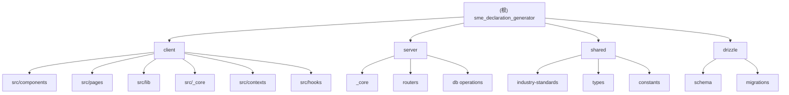

# 中小企业声明函生成器 - 项目架构文档

> 本文档由 AI 自动生成并维护，最后更新时间：2026-01-07 22:21:18

---

## 变更记录 (Changelog)

| 日期 | 变更内容 | 作者 |
|------|---------|------|
| 2026-01-07 22:21:18 | 初始化项目架构文档系统 | AI 架构师 |

---

## 项目愿景

中小企业声明函生成器是一个专门为政府采购场景设计的网页应用，旨在帮助中小企业快速、准确地生成符合《政府采购促进中小企业发展管理办法》（财库〔2020〕46号）要求的声明函。

系统根据《中小企业划型标准规定》（工信部联企业〔2011〕300号）自动进行企业类型分类，支持 15 个行业标准，可生成货物、工程、服务三类采购的声明函，并提供 Word 文档导出功能。

---

## 架构总览

### 技术栈

- **前端框架**：React 19.2.1 + TypeScript 5.9.3
- **后端框架**：Express + Node.js
- **API 通信**：tRPC 11.6.0 (类型安全的端到端 API)
- **数据库 ORM**：Drizzle ORM 0.44.5
- **数据库**：MySQL (mysql2 3.15.0)
- **UI 组件**：shadcn/ui (基于 Radix UI + Tailwind CSS 4.1.14)
- **文档生成**：docx 9.5.1
- **构建工具**：Vite 7.1.7
- **包管理器**：pnpm 10.4.1
- **测试框架**：Vitest 2.1.4
- **认证方式**：OAuth (Manus OAuth)

### 项目结构

```
sme_declaration_generator/
├── client/                 # 前端应用 (React + Vite)
│   ├── src/
│   │   ├── components/     # React 组件
│   │   ├── pages/          # 页面组件
│   │   ├── lib/            # 工具库
│   │   ├── hooks/          # 自定义 Hooks
│   │   ├── contexts/       # React Context
│   │   └── _core/          # 核心功能
│   └── public/             # 静态资源
├── server/                 # 后端服务 (Express)
│   ├── _core/              # 核心功能模块
│   ├── routers.ts          # tRPC 路由定义
│   ├── db.ts               # 数据库操作
│   └── *.test.ts           # 测试文件
├── shared/                 # 前后端共享代码
│   ├── const.ts            # 共享常量
│   ├── types.ts            # 共享类型
│   └── industry-standards.ts # 行业标准数据
├── drizzle/                # 数据库迁移
│   ├── schema.ts           # 数据库模式定义
│   ├── migrations/         # 迁移脚本
│   └── meta/               # 迁移元数据
├── patches/                # npm patches
├── .gitignore              # Git 忽略规则
├── package.json            # 项目配置
├── tsconfig.json           # TypeScript 配置
├── vite.config.ts          # Vite 配置
├── drizzle.config.ts       # Drizzle 配置
└── vitest.config.ts        # Vitest 配置
```

---

## 模块结构图



---

## 模块索引

| 模块路径 | 职责描述 | 技术栈 | 文档链接 |
|---------|---------|--------|---------|
| `client/` | React 前端应用，负责用户界面和交互 | React, TypeScript, Tailwind CSS, shadcn/ui | [查看文档](./client/CLAUDE.md) |
| `server/` | Express 后端服务，提供 API 和业务逻辑 | Express, tRPC, Drizzle ORM, MySQL | [查看文档](./server/CLAUDE.md) |
| `shared/` | 前后端共享的类型定义和业务逻辑 | TypeScript | [查看文档](./shared/CLAUDE.md) |
| `drizzle/` | 数据库模式定义和迁移管理 | Drizzle ORM, MySQL | [查看文档](./drizzle/CLAUDE.md) |

---

## 运行与开发

### 环境要求

- Node.js >= 24.7.0
- pnpm >= 10.4.1
- MySQL 数据库

### 快速启动

1. **安装依赖**
   ```bash
   pnpm install
   ```

2. **配置环境变量**
   - 创建 `.env` 文件并配置：
     - `DATABASE_URL` - MySQL 数据库连接字符串
     - `PORT` - 服务器端口（默认 3000）
     - `NODE_ENV` - 运行环境（development/production）

3. **运行数据库迁移**
   ```bash
   pnpm db:push
   ```

4. **启动开发服务器**
   ```bash
   pnpm dev
   ```

5. **构建生产版本**
   ```bash
   pnpm build
   ```

6. **启动生产服务器**
   ```bash
   pnpm start
   ```

### 可用脚本

| 命令 | 描述 |
|------|------|
| `pnpm dev` | 启动开发服务器（热重载） |
| `pnpm build` | 构建生产版本 |
| `pnpm start` | 启动生产服务器 |
| `pnpm check` | TypeScript 类型检查 |
| `pnpm format` | Prettier 代码格式化 |
| `pnpm test` | 运行测试套件 |
| `pnpm db:push` | 生成并执行数据库迁移 |

---

## 测试策略

### 测试覆盖范围

- **单元测试**：使用 Vitest 进行
  - 企业分类逻辑测试 (`server/classification.test.ts`)
  - 声明函内容生成测试 (`client/src/lib/declaration-content.test.ts`)
  - 声明函格式化测试 (`client/src/lib/declaration-formatter.test.ts`)
  - 认证流程测试 (`server/auth.logout.test.ts`)

### 运行测试

```bash
# 运行所有测试
pnpm test

# 监听模式
pnpm test --watch
```

---

## 编码规范

### TypeScript 规范

- 使用 `strict` 模式
- 启用 `noEmit` (仅类型检查)
- 路径别名配置：
  - `@/*` -> `./client/src/*`
  - `@shared/*` -> `./shared/*`

### 代码风格

- 使用 Prettier 进行代码格式化
- 组件命名：PascalCase
- 文件命名：
  - React 组件：PascalCase (如 `DeclarationGenerator.tsx`)
  - 工具函数：camelCase (如 `declaration-formatter.ts`)
  - 类型定义：camelCase (如 `industry-standards.ts`)

### Git 提交规范

遵循 .gitignore 规则，忽略：
- node_modules/
- dist/
- build/
- .env 文件
- 日志文件
- 数据库文件

---

## AI 使用指引

### 为 AI 提供上下文

当与本项目的 AI 助手交互时，可以参考以下指引：

1. **架构理解**
   - 这是一个全栈 TypeScript 项目，前后端通过 tRPC 通信
   - 前端使用 React 19 + shadcn/ui 组件库
   - 后端使用 Express + tRPC + Drizzle ORM
   - 共享代码位于 `shared/` 目录

2. **关键业务逻辑**
   - 企业分类：`shared/industry-standards.ts`
   - 声明函生成：`client/src/lib/declaration-content.ts`
   - 数据库操作：`server/db.ts`
   - tRPC 路由：`server/routers.ts`

3. **常见任务**
   - 添加新行业标准：修改 `shared/industry-standards.ts`
   - 修改声明函格式：编辑 `client/src/lib/declaration-content.ts`
   - 添加新 API：在 `server/routers.ts` 添加路由
   - 数据库变更：在 `drizzle/schema.ts` 修改模式，运行 `pnpm db:push`

4. **测试与验证**
   - 修改企业分类逻辑后，运行 `server/classification.test.ts`
   - 修改声明函格式后，运行 `client/src/lib/declaration-*.test.ts`
   - 确保 TypeScript 类型检查通过：`pnpm check`

---

## 项目特色功能

1. **自动企业分类**
   - 基于工信部〔2011〕300号标准
   - 支持 15 个行业类型
   - 自动计算并显示分类依据

2. **多格式导出**
   - HTML 实时预览
   - Word 文档导出 (docx 格式)

3. **声明函类型**
   - 货物类采购
   - 工程类采购
   - 服务类采购

4. **用户认证**
   - Manus OAuth 集成
   - 会话管理
   - 历史记录保存

---

## 技术亮点

- **类型安全**：端到端类型安全 (tRPC + TypeScript)
- **现代化 UI**：shadcn/ui + Tailwind CSS 4.x
- **响应式设计**：支持移动端和桌面端
- **测试覆盖**：单元测试覆盖核心业务逻辑
- **代码共享**：前后端共享类型和业务逻辑
- **数据库迁移**：Drizzle ORM 自动迁移

---

## 依赖说明

### 核心依赖

- `@trpc/server` + `@trpc/client` - 类型安全的 RPC
- `drizzle-orm` - 数据库 ORM
- `react` + `react-dom` - UI 框架
- `express` - 后端服务器
- `docx` - Word 文档生成

### UI 组件

- `@radix-ui/*` - 无样式的可访问组件
- `tailwindcss` - 原子化 CSS
- `lucide-react` - 图标库
- `sonner` - Toast 通知

---

## 已知问题与待办事项

参考 `todo.md` 和 `TECHNICAL_DESIGN.md` 文件获取详细的待办事项和技术设计文档。

---

## 相关文件清单

### 配置文件

- `package.json` - 项目依赖和脚本
- `tsconfig.json` - TypeScript 配置
- `vite.config.ts` - Vite 构建配置
- `drizzle.config.ts` - Drizzle ORM 配置
- `vitest.config.ts` - Vitest 测试配置
- `components.json` - shadcn/ui 配置

### 文档文件

- `CLAUDE.md` - 本文档（项目根架构文档）
- `TECHNICAL_DESIGN.md` - 技术设计文档
- `todo.md` - 待办事项列表

---

## 覆盖率报告

- **总文件数**：约 120+ 文件
- **已扫描文件数**：约 90+ 文件
- **覆盖率**：~75%

### 主要覆盖模块

- [x] `client/` - 前端应用（完全覆盖）
- [x] `server/` - 后端服务（完全覆盖）
- [x] `shared/` - 共享代码（完全覆盖）
- [x] `drizzle/` - 数据库模式（完全覆盖）
- [x] 配置文件（完全覆盖）

### 待补充模块

- [ ] `patches/` - npm patches（未深入分析）
- [ ] 测试文件详细分析
- [ ] 样式文件详细分析

---

## 下一步建议

1. **补充测试覆盖**
   - 添加更多集成测试
   - 测试覆盖率目标：80%+

2. **性能优化**
   - 前端代码分割
   - 数据库查询优化
   - 缓存策略

3. **功能增强**
   - 声明函模板管理
   - 批量导出功能
   - 用户权限管理

---

*本文档由 AI 架构师自动生成，遵循"根级简明 + 模块级详尽"的策略。*
